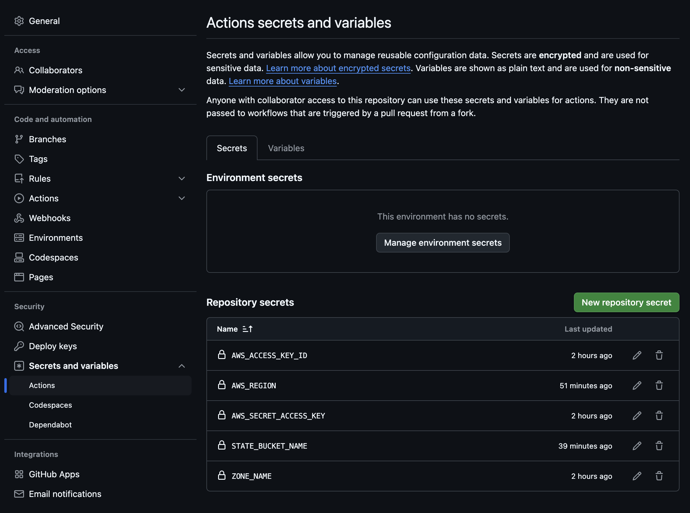
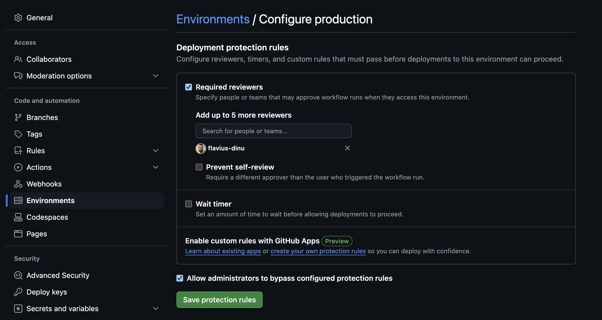
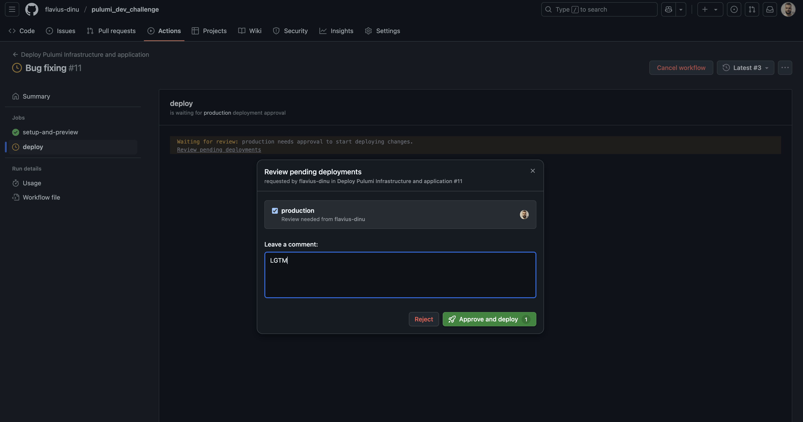

# Deploying a static website with Pulumi

The aim of this project is to showcase how to deploy a static website built using Docusaurus by using:
- Pulumi and GitHub Actions
- Pulumi and Spacelift

Repo structure explained:
- .github --  GitHub Actions workflows for deploying the Pulumi python code
- docs -- Documentation website built with Docusaurus, that can easily host your blogs and tutorials
- javascript-infrastructure -- Pulumi javascript infrastructure that will be used by Spacelift to deploy the infrastructure and the application
- python-infrastructure -- Pulumi python infrastructure that will be used by Spacelift to deploy the infrastructure and the application

## Prerequisites
- An AWS Route53 hosted zone for your domain
- An AWS S3 bucket for Pulumi state hosting
- An AWS role for building dynamic credentials for Spacelift

### How to create an AWS Route53 hosted zone
To create a Route53 hosted zone for your domain:

1. Navigate to Route53
2. Click `Hosted zones` and then choose the `Create hosted zone` option
3. Enter your domain name (e.g., example.com)
4. Select `Public hosted zone` option
5. Click on the `Create` button

After creation, AWS will assign four nameservers to your hosted zone and you'll need to update your domain registrar's settings to use these nameservers. 
This delegates DNS authority to Route53, allowing you to manage your domain's DNS records through AWS.

### How to create the State Bucket

To create a state bucket in your AWS account, follow these steps:


1. Navigate to the S3.
2. Click on the `Create bucket` button and enter a unique name for your bucket (e.g., `my-pulumi-state-bucket`).
3. Choose the us-east-1 as the region (Ensure you use the us-east-1 region, as CloudFront only accepts ACM certificates from us-east-1)
4. Keep the default settings for the rest of the options, and enable versioning
5. Click on the `Create bucket` button at the bottom of the page.

Once the bucket is created, you can use it to store the state files for your Pulumi deployments.

We will explore the role creation when we reach the Spacelift configuration.

## Components

### Static Website

The static website, built with Docusaurus, can be easily previewed locally.

Prerequisites:
- Node.js 18 or higher
- npm or yarn

First ensure you are in the `docs` folder.

To install the dependencies, run:

```bash
npm install
```
To start the development server, run:

```bash
npm start
```

This will start a local development server at http://localhost:3000.


### The infrastructure
I've created the same infrastructure using python and javascript, and for these two solutions, I will use different deployment options:
- The pyhton infrastructure will be deployed using GitHub Actions
- The javascript infrastructure will be deployed using Spacelift

I already have a Route53 hosted zone for my domain configured.

The infrastructure project sets up a complete static website hosting infrastructure on AWS, including:
- S3 bucket for static content storage with index and error documents
- CloudFront distribution for content delivery: This uses the S3 bucket as its origin and restricts access via Origin Access Identity and configures HTTPs with a custom SSL certificate
- ACM certificate for HTTPS: Used for DNS validation
- Route53 DNS configuration: 1 record for ACM certificate validation and an A record pointing to the CloudFront distribution
- Proper IAM permissions

After deployment, Pulumi will output:
- `websiteUrl`: The HTTPS URL of your website
- `cloudfrontDomain`: The CloudFront domain name
- `bucketName`: The name of the S3 bucket


### GitHub Actions workflows
There are two GitHub Actions workflows available: 
- one for the actual deployment of the Pulumi python code and the application called `pulumi-deploy` running on push 
- another one for removing the application from S3 and destroying the infrastructure called `pulumi-destroy` running manually

The workflows use secrets for AWS credentials and configuration values and stores Pulumi state in S3.

These are all the GitHub secrets you have to add.
- AWS_ACCESS_KEY_ID
- AWS_SECRET_ACCESS_KEY
- AWS_REGION
- STATE_BUCKET_NAME
- ZONE_NAME

For GitHub Actions, I've used static credentials, but for the Spacelift deployment we will leverage dynamic ones.



The `pulumi-deploy` consists of two sequential jobs:
- `setup-and-preview`: Sets up dependencies, configures AWS credentials, connects to S3 for state management, initializes/selects a Pulumi stack, and runs a preview to check what changes will be made.
- `deploy`: After the preview job completes successfully, this job performs the actual deployment by setting up the same environment, selecting the Pulumi stack, deploying the infrastructure with pulumi up, and finally building and deploying the application files to an S3 bucket. Because the deploy option uses an `environment: production` and this is configured to require a manual approval, we are ensuring that we aren't deploying any code that isn't checked first.

This is how the environment was set up for this:


Example promotion after the `setup-and-preview` job is done:


The `pulumi-destroy` workflow has a single job that removes everything from your infrastructure.


### Set up a VCS integration in Spacelift
Go to source code and select:


Next, set it up via the Wizard:


Follow the steps from there and in the end you will result in:


Click on install application and then install it in GitHub:


### Set up a Cloud Integration in Spacelift

To easily leverage dynamic credentials in Spacelift, we can take advantage of Cloud Integrations. To build this native integration, you would need to go to Cloud Integrations -> Set up Cloud Integration -> AWS:


In parallel, go to AWS and create a new role by selecting a custom trust policy:


Next, add the required permissions for creating the Pulumi resources:
- s3:*
- acm:*
- route53:*
- cloudfront:*

Of course, you could be more granular with the permissions, but because this is my account and I am the only one using it, I can easily give full permissions for these resources.

In the end, add a name for your role, and an optional description as presented here:


After you create the role, select it, and copy the ARN. We are now ready to go back to our Spacelift account and continue the creation of the cloud integration, by pasting the ARN inside the configuration form. In the end, it should look like this:


### Deploying with Spacelift
